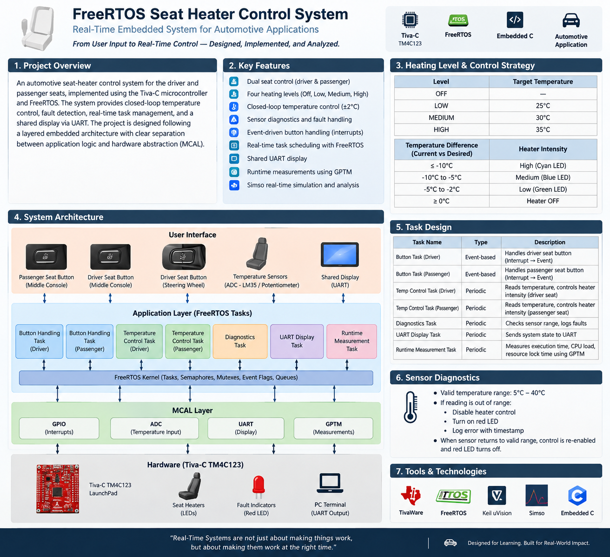

# FreeRTOS Seat Heater Control System

> A real-time automotive control system designed around FreeRTOS, event-driven input handling, closed-loop temperature control, fault diagnostics, and runtime performance analysis.

---

## Overview

The FreeRTOS Seat Heater Control System is an automotive embedded system designed to control the heating of the front two seats of a vehicle:

- Driver Seat
- Passenger Seat

The system is implemented using the Tiva-C microcontroller and FreeRTOS, with a focus on real-time behavior, task-based architecture, synchronization, hardware abstraction, diagnostics, and runtime performance measurement.

The system allows the user to select a desired heating level while continuously monitoring temperature and controlling heater intensity accordingly.

---

## System Architecture

The system follows a layered embedded architecture consisting of:

- User Interface
- Application Layer
- FreeRTOS
- MCAL
- Tiva-C Microcontroller

The User Interface contains the driver button, passenger button, and additional steering-wheel button.

Button inputs are handled through GPIO edge-triggered interrupts and are processed by the FreeRTOS application layer.

The application layer contains the seat-control logic, temperature-control logic, diagnostics, UART display, and runtime measurement functionality.

FreeRTOS provides task scheduling and synchronization mechanisms such as tasks, mutexes, semaphores, event flags, and inter-task data sharing.

The MCAL layer provides hardware abstraction for:

- GPIO
- ADC
- UART
- GPTM

---

## FreeRTOS Architecture

The system uses FreeRTOS to manage multiple concurrent activities.

The project requires at least six tasks, with task implementations reusable for the driver and passenger seats where appropriate.

The architecture considers:

- Periodic tasks
- Event-based tasks
- Mutexes for shared resources
- Semaphores and event flags for event synchronization
- Proper inter-task data sharing
- Interrupt-driven user input

The objective is to maintain high responsiveness to user input while minimizing unnecessary CPU utilization.

---

## User Interaction

Each seat has a button used to select the required heating level.

The heating level follows a cyclic state machine:

OFF -> LOW -> MEDIUM -> HIGH -> OFF

Each button press advances the system to the next heating level.

The driver seat also has an additional button located on the steering wheel.

---

## Heating Levels

| Heating Level | Desired Temperature |
|---------------|---------------------|
| OFF           | Heater disabled     |
| LOW           | 25°C                |
| MEDIUM        | 30°C                |
| HIGH          | 35°C                |

The selected heating level determines the desired temperature used by the temperature-control logic.

---

## Closed-Loop Temperature Control

The heater is controlled according to the difference between the current temperature and the desired temperature.

The control strategy is:

| Temperature Condition | Heater Intensity |
|-----------------------|------------------|
| Current temperature is 10°C or more below desired | HIGH |
| Current temperature is 5°C to 10°C below desired | MEDIUM |
| Current temperature is 2°C to 5°C below desired | LOW |
| Current temperature is above desired | OFF |

The heater is enabled again when the temperature becomes lower than the desired temperature by 2°C.

For testing purposes, the heater is simulated using LEDs:

- Green LED -> LOW intensity
- Blue LED -> MEDIUM intensity
- Cyan LED -> HIGH intensity

---

## Temperature Sensing

The temperature sensor is connected to the ADC to obtain the current temperature.

An LM35 temperature sensor can be used as the temperature sensor.

For testing and simulation, a potentiometer can be connected to the ADC instead.

The simulated input follows:

0V -> 0°C
3.3V -> 45°C

Only temperatures between 5°C and 40°C are considered valid.

---

## Fault Detection and Diagnostics

Sensor diagnostics are an important part of the system.

If the temperature sensor provides a value outside the valid range:

1. Temperature control is disabled.
2. The heater is disabled.
3. The corresponding red LED is activated.
4. The failure is logged.
5. A timestamp is recorded.

When the sensor returns to a valid reading:

- Temperature control is re-enabled.
- The red fault LED is turned off.
- Normal heater operation resumes.

The diagnostic information includes:

- Sensor failures
- Timestamp of the failure
- Last heating level selected by the user
- Timestamp of the heating-level selection

---

## Event-Driven Input Handling

Button responsiveness is handled using edge-triggered interrupts rather than continuous polling.

The intended flow is:

Button Press
    ->
GPIO Edge Interrupt
    ->
Event / Synchronization Mechanism
    ->
FreeRTOS Task
    ->
Process User Request

This approach allows the system to react to button events while avoiding unnecessary continuous polling.

---

## Hardware Abstraction and MCAL

The following modules are implemented as part of the MCAL layer:

| MCAL Module | Purpose |
|-------------|---------|
| GPIO        | Buttons and LEDs |
| ADC         | Temperature measurement |
| UART        | System display |
| GPTM        | Timing and runtime measurements |

This separation provides a clear boundary between hardware-dependent functionality and application-level behavior.

---

## Shared Resources and Synchronization

Multiple FreeRTOS tasks may access shared resources.

The system therefore identifies shared resources and provides exclusive access where required.

Synchronization mechanisms include:

- Mutexes
- Semaphores
- Event flags
- Appropriate inter-task data sharing

The objective is to prevent race conditions and avoid loss or corruption of shared data.

---

## Runtime Performance Analysis

The project also focuses on measuring the behavior of the real-time system.

GPTM is used to perform runtime measurements with a target accuracy of 0.1 ms for the implemented timer resolution.

The measurements include:

### Task Execution Time

The execution time of each task is measured using GPTM.

### CPU Load

The system measures CPU utilization to evaluate how efficiently processing time is being used.

### Resource Lock Time

The time spent by tasks while accessing shared resources is measured using appropriate FreeRTOS trace-hook mechanisms.

FreeRTOS runtime statistics may be used to validate the measurements, but the project delivery relies on the manual GPTM-based measurements.

---

## UART System Display

The current system information is transmitted through UART so that it can be displayed to the user.

The displayed information includes:

- Current temperature
- Selected heating level
- Heater state

Example:

Driver Seat
Temperature: 30°C
Level: HIGH
Heater: LOW INTENSITY

Passenger Seat
Temperature: 27°C
Level: MEDIUM
Heater: LOW INTENSITY

---

## Real-Time Simulation

A Simso simulation project is included to analyze the real-time behavior of the system.

The simulation is used to evaluate:

- Task execution
- Task timing
- Task deadlines
- Scheduling behavior
- Missed deadlines

The objective is to address tasks exceeding their deadlines and achieve a simulation with no missed deadlines where possible.

---

## Example Control Scenario

Consider the following scenario:

Passenger selects HIGH.
Initial temperature = 10°C.

The system responds according to the temperature:

10°C
-> HIGH INTENSITY

25°C
-> MEDIUM INTENSITY

30°C
-> LOW INTENSITY

35°C
-> HEATER OFF

If the temperature subsequently falls to 33°C, the heater is enabled again with low intensity.

The corresponding system information is sent through UART.

---

## Technology Stack

| Technology | Purpose |
|------------|---------|
| Embedded C | Application development |
| Tiva-C | Microcontroller platform |
| FreeRTOS | Real-time operating system |
| GPIO | Buttons and LEDs |
| ADC | Temperature measurement |
| UART | System display |
| GPTM | Timing and runtime measurements |
| Simso | Real-time simulation |

---

## Project Structure

FreeRTOS-Seat-Heater-Control-System/
|
|-- images/
|   |-- architecture.png
|
|-- FreeRTOS-Seat-Heater-Control.rar
|
|-- Seat-Heater-Simulation.rar
|
|-- README.md

FreeRTOS-Seat-Heater-Control.rar contains the Tiva-C and FreeRTOS application project.

Seat-Heater-Simulation.rar contains the Simso real-time simulation project.

---

## Engineering Concepts Demonstrated

This project brings together several embedded-systems concepts:

- Real-time operating systems
- Task-based software architecture
- Periodic and event-based execution
- Interrupt-driven design
- Inter-task communication
- Synchronization
- Mutual exclusion
- Hardware abstraction
- ADC-based sensing
- UART communication
- Timer-based measurements
- Fault detection
- Diagnostic logging
- Closed-loop control
- CPU-load analysis
- Deadline analysis
- Real-time simulation

---

## Project Deliverables

The project includes the following deliverables:

- Application task source code
- FreeRTOS configuration
- MCAL modules
- Tested ELF / HEX
- Simso simulation project
- System architecture documentation
- Shared-resource analysis
- UART output screenshots
- Runtime measurement results
- Simso simulation results

---

## Engineering Perspective

> A real-time embedded system is not only about making the system work — it is about making the right task execute at the right time, while handling concurrency, faults, resources, and system constraints predictably.

This project applies that mindset to an automotive seat-heater control system by combining real-time scheduling, event-driven software, hardware abstraction, closed-loop control, diagnostics, synchronization, and performance analysis.

---

## Author

Adham Muhammed

Embedded Software | Real-Time Systems | Automotive Embedded Systems
